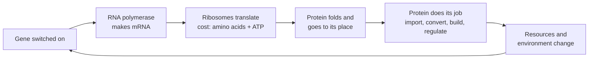
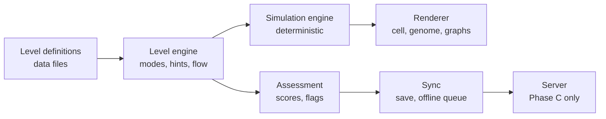

# Be the Cell — design doc

Snapshot of the living design doc (Sep 24, 2026, Alex Foxworthy). The living version is at
https://claude.ai/code/artifact/f1acbe82-c608-485e-b021-b721d3b3dec8 — when the two disagree, the living doc wins
and this file should be refreshed.

## Summary and goals

Be the Cell (working title) is a resource game where students run a cell using only one lever: which genes it expresses. Every action pays the full DNA → RNA → protein cost, so playing well requires a working model of the central dogma. It serves majors and non-majors, starts in a bacterium, moves to a human cell, and is built to become a mastery gate after a low-stakes pilot.

A dry, understated storyline carries the same arc. The player starts out believing they run the cell and wins only by letting go and being it.

It keeps NeuronSim's teaching rules: predict before observing, draw every visual from model state, never advance just because time passed, and give each wrong answer its own feedback. The closest existing tools are PhET's gene expression simulation, Foldit, Eterna and [LacOp](https://doi.org/10.1002/bmb.21638). None of them is a resource game where every action has to go through the central dogma.

**Goals**

- Students can predict and explain what DNA, RNA and proteins each do, not just name them.
- Students see proteins as machines whose shape gives them a job.
- Students leave knowing their own cells do all of this, plus what the nucleus adds.
- Game scores are valid enough evidence of understanding to gate progress.
- It runs on every device students own: Chromebook, Windows, Mac, iPhone and Android.

**Pilot success criteria (proposed)**

- Level scores correlate with Central Dogma Concept Inventory post-test scores.
- Pre-to-post inventory gains are at least as large as in sections without the game.
- Phone players and laptop players score the same for the same understanding.
- A typical level takes 5–10 minutes.

## Learning objectives and misconceptions

The game targets ten objectives, and every level states which ones it gives evidence for. LO10 is majors-only; the rest apply to both tracks.

| ID | Objective: students can… |
| --- | --- |
| LO1 | Explain that DNA stores instructions, RNA carries working copies, and proteins do the work. |
| LO2 | Predict how one gene yields many mRNAs and each mRNA yields many proteins, and explain why mRNA exists. |
| LO3 | Explain that making RNA and protein uses ATP and building blocks, so unneeded expression has a cost. |
| LO4 | Predict how levels change when molecules are constantly made and broken down, including delays. |
| LO5 | Explain how sequence sets shape, shape sets function, and why mutation effects depend on type and position. |
| LO6 | Explain gene regulation as proteins responding to signals, with no central decision-maker. |
| LO7 | Identify what bacteria and human cells share (code, ribosomes, central dogma) and what eukaryotes add. |
| LO8 | Explain that cells in one body share a genome and differ in which genes they express. |
| LO9 | Explain that getting energy from food requires protein machines, and that oxygen-using machinery yields much more ATP. |
| LO10 | (Majors) Reason about trade-offs in how a cell divides its protein budget between ribosomes and metabolism. |

Each misconception below has a level built to confront it and an in-game behaviour that flags it. Those flags feed the instructor dashboard (see Assessment).

| Misconception | Confronted in | Signal in play |
| --- | --- | --- |
| DNA acts directly or "makes" the trait | Prologue, 1.1 | Expects the environment to change before any protein exists; debrief choice |
| Proteins are food or material, not machines | 1.1, 1.5 | Debrief choice |
| mRNA is a pointless middleman | 1.2 | Keeps transcribing past the target; predicts protein stops rising the moment transcription stops |
| Once made, molecules last | 1.4 | Pulses a gene on and off; predicts a flat level after expression stops |
| All mutations are equally harmful | 1.5 | Predicts a silent mutation breaks the protein |
| Food is energy by itself; ATP is free | 1.3, 1.8 | Expects ATP to rise before glucose-processing enzymes exist |
| The cell "decides"; someone is in charge | 1.7, 2.4 | Debrief explanation choices |
| Bacteria do this; human cells don't, or do it differently | Bridge, 2.1 | Wrong carry-over predictions in 2.1 |
| Bacteria are "primitive"; human cells are an upgrade | Bridge, 2.1 | Debrief choice |
| Different cell types have different DNA | 2.6 | Tries to edit the genome to make the second cell type |

## Core design: the player is the genome

The player can only change which genes are expressed. Everything else in the cell happens because a protein encoded in the genome does it. There is no button that builds a machine.

Each pass round the loop takes time and resources, and its products decay. That delay, cost and turnover is the biology the score measures.

**On screen**

- **Cell view:** membrane, cytoplasm and, in chapter 2, a nucleus. Dots are sampled from model counts ("1 dot = 50 proteins").
- **Genome strip:** the genes, initially unlabeled. A gene is named only after the student has seen what its protein does.
- **Resource bar:** ATP, amino acids, nucleotides, free ribosomes.
- **Graphs:** mRNA, protein and ATP over time, as with NeuronSim's voltage trace.
- **Narrator line:** one sentence on what is happening and why.

**Resources**

| Resource | Used for | Comes from |
| --- | --- | --- |
| ATP | Every step; mostly translation | Glucose, broken down by enzymes the player must express |
| Amino acids | Building proteins | Imported by transporters, or made by enzymes |
| Nucleotides | Building mRNA | Recycled from decayed mRNA, plus synthesis |
| Ribosomes | Translation; limits how many proteins are made at once | Fixed early; majors can invest in more (1.9) |
| RNA polymerase | Transcription; limits how many genes run at once | Fixed; a protein like any other |
| Membrane space | Holding transporters and receptors | Grows as the cell grows |

**Rules that keep it honest**

- Proteins only come from expression.
- Every step has a real delay; mRNA and proteins break down.
- Expressing proteins the cell doesn't need slows growth. This is measured bacterial physiology, not a made-up penalty ([Scott & Hwa, 2011](https://doi.org/10.1016/j.copbio.2011.04.014)).

**Two modes**

| Mode | What the player does | Why |
| --- | --- | --- |
| Operator (early levels) | Switches genes on and off in real time | Intuitive entry point; builds a feel for delay and cost |
| Designer (later levels) | Edits the DNA before the run (promoters, operator sites, regulator genes), then presses play and cannot touch it | The cell must respond through its own molecules |

Moving from operator to designer is itself a lesson: nobody is in charge, and regulation is done by proteins encoded in the same DNA. Designer solutions are also better assessments. They are fixed designs that can be inspected, re-run and compared, and nobody gets through on fast reflexes.

## Story: learning to let go

The story and the biology follow one arc. The player starts convinced they run the cell and wins in the end only by letting go. Each loss of control is a plot beat and also a real change in how the game plays.

The tone is dry and understated: Monkey Island's deadpan without its slapstick. There is enough levity that the quest never feels solemn or religious, and never so much that it upstages the biology. The joke is always on the belief that someone is in charge, so the humor teaches the lesson rather than undercutting it.

| Character | Role | Comic engine | Biology it carries |
| --- | --- | --- | --- |
| The Commander (the player) | Hero who believes they run the cell | Gives orders that nothing obeys | The misconception that someone is in charge |
| Narrator | Dry, affectionate commentary | Deflates the Commander's plans | The cause-and-effect explanation, one line at a time |
| The Ribosome | Mentor, on the job for billions of years | "I read whatever mRNA lands on me. I have never once made a decision." | The same machine in every cell, bacterial and human |
| The Virus | Recurring "villain" (1.6, returns in chapter 2) | The Commander casts it as a schemer; it's only instructions your ribosomes happen to read | A genome with no machinery of its own |
| Everything else | Background molecules | "I don't want anything. Things bump into me. Sometimes they fit." | Random collisions and shape-matching, not choice |

| Story beat | Levels | Control the player loses | How the game changes |
| --- | --- | --- | --- |
| The call: "Congratulations, you're in charge of a cell" | Prologue | — | Zoom from the student into their own body. The promotion is the joke. |
| Trials: every order needs a protein | 1.1–1.5 | Acting directly | Operator mode: genes are the only lever |
| Betrayal: your ribosomes work for the Virus | 1.6 | Ownership of the machinery | Ribosomes translate any mRNA |
| Ordeal: too fast to command | 1.7 | Real-time control | Designer mode begins; the Commander's console loses its buttons |
| Threshold: it was never about the bacterium | Bridge, 2.1 | The cell they mastered | The same Ribosome turns up in the student's own cell |
| Deeper in: the DNA is locked in a nucleus | 2.1–2.4 | Closeness to the action | Instructions travel further and wait longer |
| Letting go of "the" cell | 2.6 | The idea of one right design | One genome, many cell types |
| Being the cell | 2.7 | All input | The final run has no controls. It works with no one in charge, or it doesn't. |

Closing line (draft): "There was never anyone in charge. There was only this, happening. You were it all along."

**Writing rules**

- Molecules never want, decide or know. Only the Commander thinks that way, and the story proves them wrong.
- One or two lines per beat, skippable and replayable. No line carries biology the simulation doesn't also show.
- Dialogue lives in data files separate from the code, so it can be rewritten freely.
- Every joke is checked against the misconception list before it ships.
- Deadpan over punchlines: understatement and dry asides, never slapstick. Humor is playtested with the small group like any other mechanic.

## Universality: from bacteria to your own cells

Chapter 1 uses a bacterium as the simplest cell that does it all, never as the topic itself. Six mechanisms make sure students carry what they learn to their own cells.

1. **Start in the student's body.** The prologue zooms from the student into a pancreatic cell making insulin, then onto a ribosome reading mRNA. Only then: "To see how this works, start with the simplest cell that does it all."
2. **Stamp every card.** Each molecule, tool and concept the student collects in chapter 1 is stamped **Universal** or **Bacteria-only**. The Bacteria-only list stays short: operons, no nucleus, transcription and translation happening together, a circular chromosome.
3. **"Meanwhile, in you" after every chapter 1 level.** One or two screens show the same process in a human cell, using a real example (table below).
4. **A bridge level with both cells side by side.** In "Magic bullet", the student picks a drug target that stops an infection without harming the patient. Only targets that differ between the two cells work, such as the bacterial ribosome or cell wall. Shared targets, like the genetic code, would harm the patient too.
5. **Chapter 2 opens with a replay.** Level 2.1 repeats level 1.1 in a human cell. First the student predicts which strategies carry over, and that prediction is scored.
6. **Transfer questions about human cells in every mastery check.** A student who passes the chapter 1 levels but misses those questions has not mastered them.

| After level | Meanwhile, in you |
| --- | --- |
| 1.1 Transporter | Glucose transporters let your gut and muscle cells take in sugar. |
| 1.2 Many copies | A pancreatic beta cell makes insulin from many copies of one mRNA. |
| 1.4 Turnover | Your proteins are replaced constantly. Red blood cells lose their nucleus, can't make new proteins, and wear out in about 120 days. |
| 1.5 Mutation | Sickle-cell disease: one amino-acid change reshapes hemoglobin. |
| 1.6 Virus | Flu viruses use your ribosomes. mRNA vaccines deliver an mRNA that your ribosomes translate. |
| 1.7 Regulation | Your cells switch genes on and off with regulatory proteins called transcription factors (no operons). |
| 1.8 Oxygen | In your cells, the oxygen-using step happens in mitochondria, which have their own bacteria-like ribosomes. |

**Language rules.** Never call human cells "advanced", an "upgrade" or "evolved from bacteria", and never call bacteria "primitive". Bacteria and human cells are two designs that both descend from a common ancestor. Each has its own trade-offs.

## Campaign

The campaign has a prologue, 9 bacterial levels, a bridge and 7 human-cell levels. Everyone plays the same core levels. Expert objectives and one extra level (1.9) extend it for majors.

**Tracks.** Majors and non-majors share one course, so there is one game and one link. Every level has **Core** objectives for everyone and **Expert** objectives that everyone can see. For majors, Expert objectives and level 1.9 are required through a separate Canvas assignment given only to a majors group. For non-majors they are optional bonuses. Majors also get number-based predictions and tighter par targets; non-majors get more hints and narration.

**Timing.** Chapter 1, the bridge and levels 2.1–2.3 fit this unit. Levels 2.4–2.7 come later, and 2.5 after the respiration unit. Instructors can assign any subset.

### Chapter 1: a bacterium

| # | Level | Mode | LOs | Challenge | Expert objective |
| --- | --- | --- | --- | --- | --- |
| P | You, right now | Guided | LO1, LO7 | Zoom from the student to a beta cell, a ribosome, then a bacterium. Not scored. | — |
| 1.1 | Starving next to a feast | Operator | LO1 | Glucose sits outside and can't cross the membrane. Find the transporter among 6 unlabeled genes in as few experiments as possible. | Identify two genes on the same budget |
| 1.2 | One gene, many copies | Operator | LO2 | 500 transporters by a deadline. Sketch the predicted protein curve first. | Predict copies per mRNA as a number |
| 1.3 | The price of a protein | Operator | LO3, LO9 | Tight ATP and amino-acid budget. Glucose-processing enzymes must be made first. | Compare costs of long and short proteins |
| 1.4 | Nothing lasts | Operator | LO4 | Hold a protein level inside a band for 10 game-minutes while molecules break down. | Set promoter strength to hit a steady state worked out from rates |
| 1.5 | Shape is function | Operator + folding puzzle | LO5 | Four mutant strains; one transporter fails. Diagnose which and why. | How the position of a frameshift or stop codon changes the damage |
| 1.6 | Hijacked | Operator | LO1, LO7 | A virus injects its genome and your ribosomes start making viral proteins. Mount a defense. | CRISPR-style memory of past infections |
| 1.7 | Nobody's in charge | Designer | LO6 | Glucose and lactose alternate unpredictably. Wire the lac operon before the run. | Glucose preference; predict mutant strains' behaviour |
| 1.8 | Breathing room | Designer | LO9, LO3 | Oxygen appears. Oxygen-using machinery is costly to build but yields far more ATP. Decide when to invest. | Membrane location of the machinery |
| 1.9 | Machines that build machines | Designer | LO10 | Required for majors, optional for others. Maximize growth in rich and poor media by dividing expression between ribosomes and metabolic proteins. | — |
| B | Magic bullet | Side-by-side | LO7 | Pick a drug target that stops the bacterium and spares the human cell. | Why some antibiotics affect mitochondria |

### Chapter 2: your cells

| # | Level | Mode | LOs | Challenge | Expert objective |
| --- | --- | --- | --- | --- | --- |
| 2.1 | Déjà vu | Operator | LO7 | Replay 1.1 in a human cell. Predict what carries over; the nucleus adds an export delay. | — |
| 2.2 | Edit before export | Operator | LO7, LO4 | mRNA must be processed and exported before translation. Human mRNAs last longer. | Alternative splicing: two proteins from one gene |
| 2.3 | Shipping department | Designer | LO5, LO7 | A plasma cell must secrete antibodies. A missing address tag leaves them stuck inside. A beta cell secreting insulin can be added later as a variant. | Where the tag is read, and why it is removed |
| 2.4 | Signals from outside | Designer | LO6 | A hormone arrives. Build the receptor → transcription factor → gene response. | Signal amplification |
| 2.5 | Powerhouse | Designer | LO9 | After the respiration unit. A muscle cell exercises and must supply ATP with mitochondria and oxygen. | Oxygen debt and lactate |
| 2.6 | Same genome, different cell | Designer | LO8 | One unchanged genome. Build a muscle cell, then a neuron, by changing only expression. | Why the switch is hard to reverse |
| 2.7 | Divide | Designer | All | Copy the genome with DNA polymerase, which is itself a protein. Double everything and divide as the environment changes. | Replication cost and time |

## Energy thread

In this unit, students meet ATP as currency they spend, produced only by protein machines they build. The chemistry of respiration waits for the respiration unit and level 2.5. Following NeuronSim's rule, names come after function: early levels show a black-box "glucose-processing machinery", not glycolysis steps.

| When | Level | What students experience | Intuition seeded | Named |
| --- | --- | --- | --- | --- |
| This unit | 1.3 | Glucose becomes ATP only once they express the enzymes. Running out of ATP stalls everything, including making more enzymes. | Getting energy from food needs protein machines, and the cell spends ATP constantly | ATP |
| This unit | 1.2–1.4 | Translation is the largest ATP expense on the resource bar. | Making proteins is the cell's main energy cost ([Klumpp et al., 2013](https://doi.org/10.1073/pnas.1310377110)) | — |
| This unit | 1.8 | Oxygen appears. The oxygen-using machinery is expensive to build, then yields about 15× more ATP per glucose (about 30 vs 2). | Oxygen lets a cell get much more energy from the same food | Fermentation and respiration, after the student has seen the difference |
| This unit | Bridge | Some antibiotics also affect mitochondria, whose ribosomes resemble bacterial ones. | Mitochondria look like bacteria | Mitochondria |
| After respiration | 2.5 | A muscle cell exercising: mitochondria, oxygen supply, lactate. | The full picture | Terms from the respiration unit |

ATP figures are approximate textbook values, to be checked in BIOLOGY.md before building.

## Simulation model

The engine tracks molecule counts, not individual molecules, like NeuronSim's conductance model: students never see equations, but the behaviour is right. The authoritative model is in `docs/MODEL.md`; this section is the design intent.

- Per gene: mRNA is made at a rate set by promoter activity and removed by decay; protein is made from mRNA by ribosomes and removed by degradation and growth dilution.
- Each step draws on ATP, amino acids and nucleotides, and stalls when they run short.
- **Honest scale.** Game time runs faster than real time, and the speed is always shown. A legend states how many molecules each dot stands for.
- **Deterministic.** All randomness comes from a seed, so the same inputs always give the same run. This allows per-student level variants and server-side replay to check scores.
- **Biology tests** (like NeuronSim's `tests/biology.test.js`): steady state = synthesis ÷ removal; protein lags mRNA and keeps rising briefly after transcription stops; one mRNA yields many proteins; an unneeded protein lowers growth rate; lac operon truth table with mutants (later); silent vs frameshift (later); nuclear export delay (later); ATP exhaustion halts translation and recovery depends on existing enzymes; oxygen raises ATP per glucose about 15-fold (later).
- **Level tests.** Every level ships with a reference solution that must pass and "misconception" solutions that must fail or miss par, such as expressing every gene.

## Assessment and the mastery gate

Scores come from what students do in the simulation, combined so that no single component can be gamed on its own. This is stealth assessment ([Shute & Ventura, 2013](https://doi.org/10.7551/mitpress/9589.001.0001)). The game starts as low-stakes assignments and becomes a mastery gate once the pilot shows the scores track understanding.

**Evidence map.** Each level's data file lists its objectives, the behaviour that counts as evidence, and the flags for each misconception. For example, level 1.2 records whether transcription stopped before the target and how closely the sketched protein curve matched.

| Component | Measures | Gathered by | How hard to game |
| --- | --- | --- | --- |
| Goal met | Basic competence | Simulation outcome | Easy by trial and error, so never enough alone |
| Efficiency vs par | Understanding of cost and timing | ATP wasted, unneeded proteins, time | Hard |
| Prediction sketch | The student's model of cause and effect | Sketched curve vs model output, before the run | Very hard |
| Debrief | Explanation | 1–2 questions with feedback for each wrong answer | Moderate |
| Transfer | Generalization, including to human cells | A fresh, unfamiliar variant | Hard |

**Integrity**

- **Per-student variants.** Gene order, parameters and environment schedules come from a seed tied to the student, so a shared solution fails for others.
- **Replay verification.** A submitted solution (design, inputs, seed) is re-run on the server, so a score can't be forged.
- **First attempts count separately** from best scores.
- **Practice is unlimited.** Every mastery attempt uses a fresh variant.

**Mastery rule (proposed).** A level is mastered when a fresh variant is completed within par, the prediction clears a threshold, and the debrief is right on the first try. Thresholds for each track come from pilot data. Retries are unlimited, each with a new variant.

| Phase | Stakes | What happens |
| --- | --- | --- |
| A: pilot | Completion credit | Central Dogma Concept Inventory before and after ([Newman et al., 2016](https://doi.org/10.1187/cbe.15-06-0124)). Lac Operon Concept Inventory for level 1.7 ([Stefanski et al., 2016](https://doi.org/10.1187/cbe.15-07-0162)). Consented telemetry, plus think-aloud sessions with 5–8 students. |
| B: calibrate | Low | Set thresholds per track. Revise levels whose scores don't track the inventories. Check that device and prior gaming experience don't predict scores. |
| C: mastery gate | Gating | Launched from Canvas (LTI 1.3), grades sent to the Canvas gradebook, and server-side replay checks. |

**Comparison.** The course runs in several sections through the year, so the pilot can compare sections with and without the game on the same inventories. To keep it fair, comparison sections get the game after their post-test.

**IRB (decided: not now).** Pilot data are used only to improve the course and the game. Publishing data collected without prior IRB review is harder and sometimes impossible. If publication becomes a goal, get approval before the next semester's data collection.

## Platform and delivery

Build one web app, designed for phones first, that installs to the home screen and works offline (a "progressive web app"). It runs on Chromebooks, Windows, Macs, iPhones and Android phones. Students get it through a link in Canvas, with no app store. Store apps can be made later from the same code if they ever matter.

| Option | Runs on | Delivery | Cost and upkeep | Verdict |
| --- | --- | --- | --- | --- |
| Web app (installable) | Every device students have, in any modern browser | A link; "Add to Home Screen" gives an app icon | Free static hosting (GitHub Pages) for the pilot; updates reach everyone at once | **Recommended** |
| Native iOS and Android apps | Phones and tablets only. Not Windows or Mac laptops; Chromebooks only if Android apps are allowed. | App Store and Google Play installs; managed school devices may block them | Two builds; store review on every update; Apple about $99/year, Google $25 once (approximate) | Not first: laptops would still need the web version |
| Web app wrapped for the stores | Same as native | Same as native | Same store costs; same code as the web app | Later, if a store listing helps |
| Desktop download | Windows and Mac only | Installer files | Code-signing costs | No: Chromebooks can't run it |

**What designing for phones first means**

- **Portrait layout.** One main view at a time (Cell · Genome · Graphs tabs), expanding into side-by-side panels on laptops.
- **Touch-only controls.** Large targets, no information that needs hover, no keyboard-only shortcuts. NeuronSim's space-bar pause becomes an on-screen button.
- **Short sessions.** Levels take 5–10 minutes, save after every action, and resume on any device.
- **Designer mode suits phones.** Edit, press run, watch. Sketching predictions with a finger is easier than with a mouse.
- **Low-end hardware.** The engine computes counts and the screen draws a sample of dots, so older phones and Chromebooks stay smooth.
- **Offline play.** The whole simulation runs on the device, so caching it for offline play costs nothing in quality. Only submitting results needs a connection, and results wait until the device is back online.
- **iPhone storage.** Safari can clear a website's saved data after about a week without a visit unless it's installed to the home screen. Progress must reach a server before it counts for credit.
- **Accessibility.** A colour-blind-safe palette, text alternatives for key state, a reduced-motion option, and a narrator line screen readers can read.
- **Fairness.** Phase B checks that phone players and laptop players score alike.

**Sign-in and grades by phase**

- **Small-group tests and the spring pilot (Phase A):** no accounts. Canvas links to the game. At the end of a level, the game shows a completion code (level, score, variant and a checksum) that students paste into a Canvas quiz. It's easy to run and weak on integrity, which is fine at low stakes.
- **Mastery gate (Phase C):** students launch the game from a Canvas assignment through LTI 1.3, the standard that passes identity and grades between Canvas and a tool. Scores post to the Canvas gradebook automatically. A small server stores results and replays solutions to verify them. Your Canvas admin has to register the tool once (a "developer key"), so start that conversation well ahead of time. Telemetry stays pseudonymous and follows your institution's FERPA policies.

## Architecture

The code reuses NeuronSim's three-way split: a pure simulation engine, a level engine that reads level definitions, and a renderer that draws only from engine state. Assessment and sync modules are added on top.

Levels are data, so adding a level doesn't touch the engine. The server exists only for the mastery phase.

| Module | Responsibility |
| --- | --- |
| `engine/` | Rates, resources, regulation, mutations, folding model. Plain JavaScript that runs in the browser and in Node for tests. |
| `levels/` | One file per level: genome, environment schedule, goals, par, prediction prompts, debriefs, evidence map, variant generator, reference and misconception solutions. |
| `game/` | Operator and designer modes, level flow, hints. Story and narrator lines load from separate data files. |
| `views/` | Cell, genome strip, graphs, folding puzzle. SVG and canvas, responsive. |
| `assess/` | Scoring, telemetry events, misconception flags, completion codes. |
| `sync/` | Local save, offline queue, server calls. |
| `server/` | Phase C: sign-in, LTI, replay verification, instructor dashboard. |

**Tooling.** Vanilla JavaScript as in NeuronSim, plus a web-app manifest and offline caching. A small bundling step produces the deployable build. It is hosted on GitHub Pages for the pilot.

## Roadmap

Small-group testing starts as soon as the free-play lab and the first levels exist, and chapter 1 is ready for class this spring. Chapter 2 follows during the spring term. The mastery gate comes only after the spring pilot has been analysed.

| Milestone | Contents | Unlocks | Target |
| --- | --- | --- | --- |
| M0 Foundations | New repo, docs set, engine skeleton, biology tests | — | Now |
| M1 Free-play lab | Bacterium with about 6 genes, expression controls, live graphs; phone and laptop | First small-group sessions | Fall 2026 |
| M2 Playable slice | Prologue and levels 1.1, 1.2, 1.4 and 1.7 with their story beats; completion codes; telemetry | Think-aloud tests with the small group | Fall 2026 |
| M3 Chapter 1 | Levels 1.3, 1.5, 1.6, 1.8 and 1.9, the bridge, Expert objectives | Phase A pilot in class | Before spring term (January 2027) |
| M4 Chapter 2 | Levels 2.1–2.3 before the unit's spring dates; 2.4–2.7 before the later units | Full campaign | Spring 2027 |
| M5 Mastery | Server, Canvas LTI 1.3, replay verification, instructor dashboard | Phase C mastery gate | After the pilot analysis; fall 2027 at the earliest |

## Decisions and open questions

| Question | Decision |
| --- | --- |
| LMS | Canvas |
| Timeline | Small-group testing as soon as possible; class use this spring |
| IRB | Not for now (see Assessment) |
| Majors and non-majors | One course, so one game with Core and Expert objectives |
| Comparison | Possible across the year's sections |
| Featured human cells | Plasma cell (2.3), muscle cell and neuron; beta cell as a later variant of 2.3; the red blood cell appears as an example after 1.4 |
| Links to NeuronSim and the muscle sim | None inside the game, since this game's style may drift through revisions. Canvas can still link them. |
| Name | Be the Cell (working title); repository be-the-cell |
| Story | A dry, understated "letting go" arc with a narrator (see Story) |
| Accessibility | The baseline in Platform and delivery; nothing more |
| Offline play | Yes, since it costs nothing in quality; quality comes first |
| Start | Go given; M0 and M1 under way |

- [ ] Which weeks of the spring term does this unit run? That sets when levels 2.1–2.3 must be ready.
- [ ] Who is in the small test group, and when can they start? Five to eight students is enough.

## References

- Charczenko, R., McMahon, M., Kandl, K., et al. (2022). LacOp: A free web-based lac operon simulation that enhances student learning of gene regulation concepts. *Biochemistry and Molecular Biology Education, 50*(4), 360–368. https://doi.org/10.1002/bmb.21638
- Klumpp, S., Scott, M., Pedersen, S., & Hwa, T. (2013). Molecular crowding limits translation and cell growth. *PNAS, 110*(42), 16754–16759. https://doi.org/10.1073/pnas.1310377110
- Newman, D. L., Snyder, C. W., Fisk, J. N., & Wright, L. K. (2016). Development of the Central Dogma Concept Inventory (CDCI) assessment tool. *CBE—Life Sciences Education, 15*(2), ar9. https://doi.org/10.1187/cbe.15-06-0124
- Scott, M., & Hwa, T. (2011). Bacterial growth laws and their applications. *Current Opinion in Biotechnology, 22*(4), 559–565. https://doi.org/10.1016/j.copbio.2011.04.014
- Shute, V. J., & Ventura, M. (2013). *Stealth assessment: Measuring and supporting learning in video games*. MIT Press. https://doi.org/10.7551/mitpress/9589.001.0001
- Stefanski, K. M., Gardner, G. E., & Seipelt-Thiemann, R. L. (2016). Development of a lac operon concept inventory (LOCI). *CBE—Life Sciences Education, 15*(2), ar24. https://doi.org/10.1187/cbe.15-07-0162
